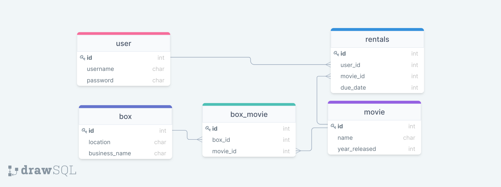

# Blue Box

Blue Box is a dvd rental company looking to get started in Nashville. Their developer had to leave on a month long tour in Canada and couldn't finish the rest of the server side code. The developer was able to complete the models and tests but not all the views and serializers.

## ERD

## Steps to start
1. After cloning the repository, run `pipenv install && pipenv shell`
2. Migrate the database: `python3 manage.py migrate`
3. Load the database" `python3 manage.py loaddata fixtures`
4. Use Postman or Thunder Client to check the output of each method
5. User Tokens to use:
   * User 1: `78c1b0485a3b3f5084ff78982de9fc338b074922`
   * User 2: `0ffa67a387c6b98a8e8165c2115032139af33cdc`
   * User 3: `fbc4991f0116bbce44ed9188c6bee36f77efcefc`

## Requirements

### Serializers
The serializers are in the `serializers` folder. Keep the class names the same but add the required `Meta` class to the serializers

* __MovieSerializer__
  * The fields should include the id, name, description, and year_released
* __BoxSerializer__
  * The fields should include the id, location, business_name, and movies
* __RentalSerializer__
  * The fields should include the id, user, movie, and due_date

### Views
* __BoxView__
  * `list` method should return all the box objects in the database
* __MovieView__
  * `list` method should include functionality to filter by a `box_id`. If a `box_id` is passed in as a query parameter
* __RentalView__
  * `create` method should create a new rental for the user that is logged in.
    * The `due_date` should be 2 weeks from the current date. Check out how to do that using [timedelta](https://www.studytonight.com/python-howtos/how-to-add-days-to-date-in-python)
  * `retrieve` should return the requested rental object
  * `destroy` should delete the rental object
  * `my_rentals` should be a custom GET action that returns the currect users rentals

## Testing
* To run all of the tests: `python manage.py test`
* Run the `MovieView` tests: `python3 manage.py test blue_box_api.tests.test_movie_view`
* Run the `BoxView` tests: `python3 manage.py test blue_box_api.tests.test_box_view`
* Run the `RentalView` tests: `python3 manage.py test blue_box_api.tests.test_rental_view`
* Once all the tests are passing push up your work to github
